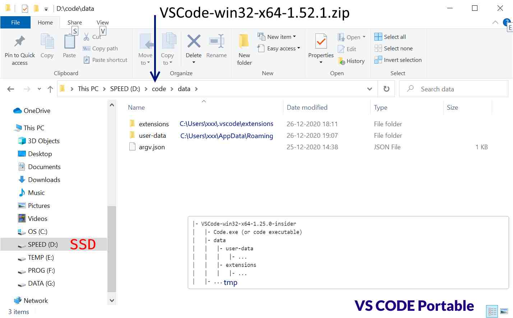

## VS Code

### Installation (Portable mode)

Unzip code-x64.zip to folder on SSD drive

Create a data folder under root of the installation folder

### Win Context Menus

Double-click the `OpenWithCode.reg` file to add VS Code to context menus.

---

## Migration

Move code and extensions folder from VS Code App installation to
data folder. Rename code to user-data
